# APDrawingGAN

We provide PyTorch implementations for our CVPR 2019 paper "APDrawingGAN: Generating Artistic Portrait Drawings from Face Photos with Hierarchical GANs".

This project generates artistic portrait drawings from face photos using a GAN-based model.
You may find useful information in [preprocessing steps](preprocess/readme.md) and [training/testing tips](docs/tips.md).

[[Paper]](http://openaccess.thecvf.com/content_CVPR_2019/html/Yi_APDrawingGAN_Generating_Artistic_Portrait_Drawings_From_Face_Photos_With_Hierarchical_CVPR_2019_paper.html) [[Demo]](https://apdrawing.github.io/)

[[Jittor implementation]](https://github.com/yiranran/APDrawingGAN-Jittor)


## Our Proposed Framework
 
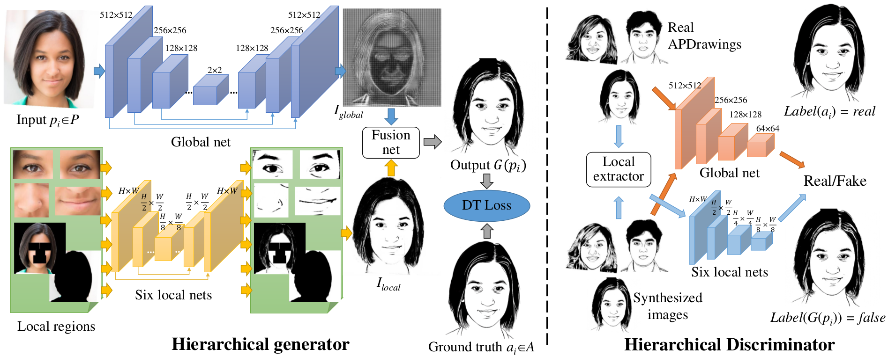

## Sample Results
Up: input, Down: output
<p>
    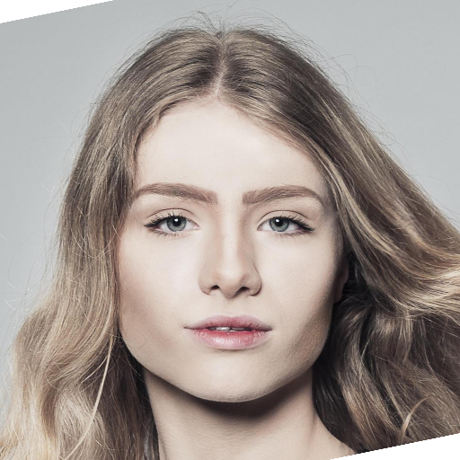
    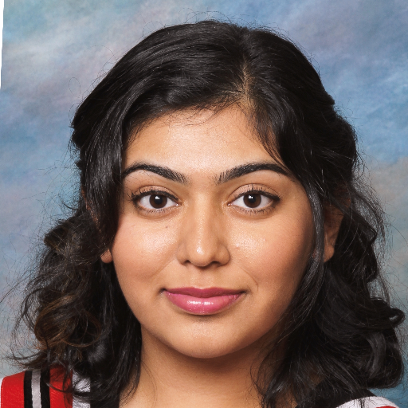
    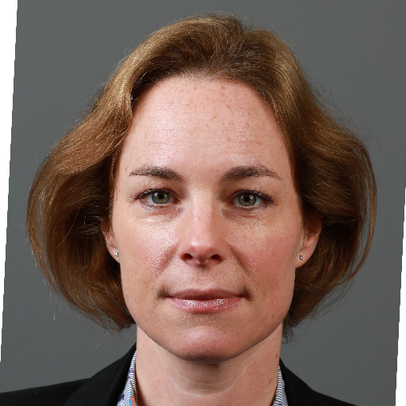
    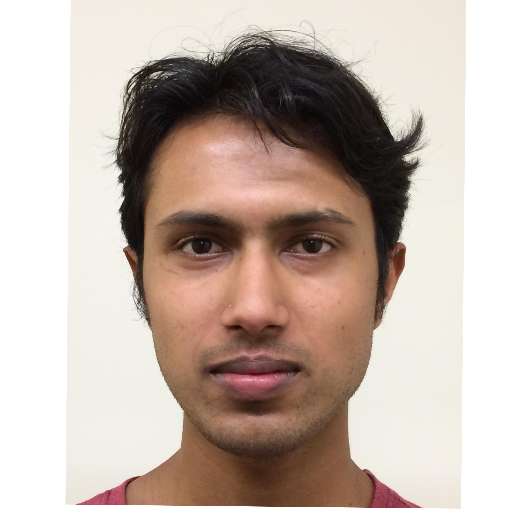
    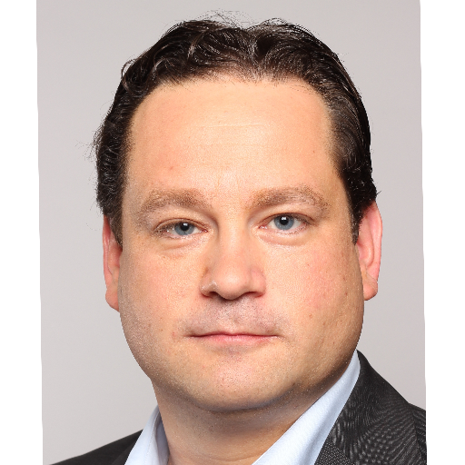
</p>
<p>
    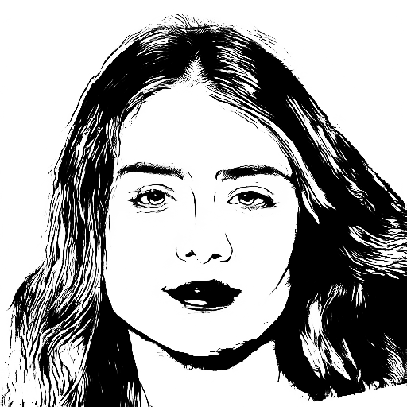
    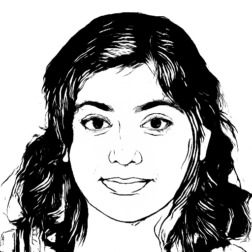
    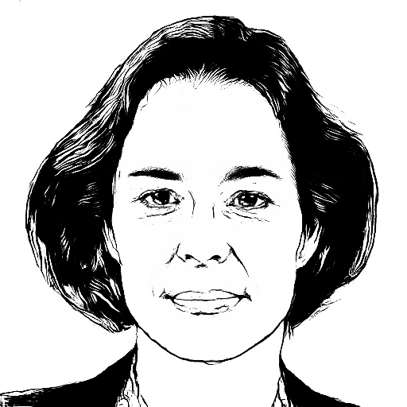
    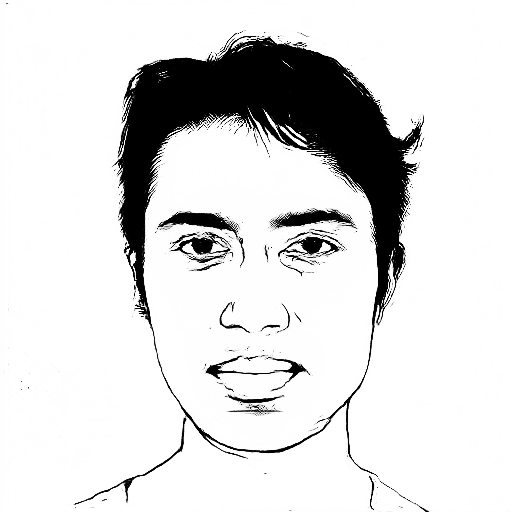
    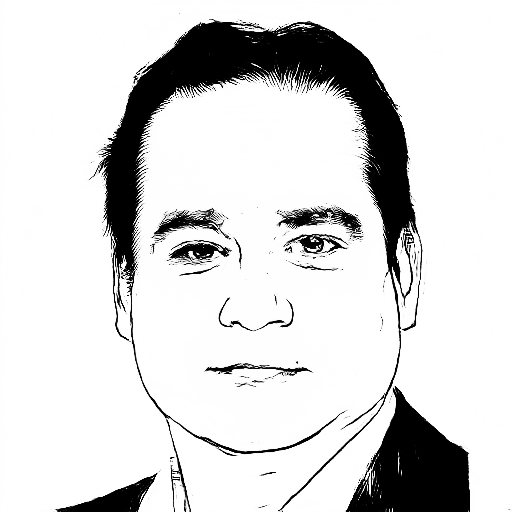
</p>

## Citation
If you use this code for your research, please cite our paper.
```
@inproceedings{YiLLR19,
  title     = {{APDrawingGAN}: Generating Artistic Portrait Drawings from Face Photos with Hierarchical GANs},
  author    = {Yi, Ran and Liu, Yong-Jin and Lai, Yu-Kun and Rosin, Paul L},
  booktitle = {{IEEE} Conference on Computer Vision and Pattern Recognition (CVPR '19)},
  pages     = {10743--10752},
  year      = {2019}
}
```

## Prerequisites
- Linux or macOS
- Python 2.7
- CPU or NVIDIA GPU + CUDA CuDNN


## Getting Started
### Installation
- Install PyTorch 0.4+ and torchvision from http://pytorch.org and other dependencies (e.g., [visdom](https://github.com/facebookresearch/visdom) and [dominate](https://github.com/Knio/dominate)). You can install all the dependencies by
```bash
pip install -r requirements.txt
```

### Quick Start (Apply a Pre-trained Model)

- Download a pre-trained model (using 70 pairs in training set and augmented data) from https://cg.cs.tsinghua.edu.cn/people/~Yongjin/APDrawingGAN-Models1.zip (Model1) and put it in `checkpoints/formal_author`.

- Then generate artistic portrait drawings for example photos in `dataset/data/test_single` using
``` bash
python test.py --dataroot dataset/data/test_single --name formal_author --model test --dataset_mode single --norm batch --use_local --which_epoch 300
```
The test results will be saved to a html file here: `./results/formal_author/test_300/index.html`.
- If you want to test on your own data, please first align your pictures and prepare your data's facial landmarks and background masks according to tutorial in [preprocessing steps](preprocess/readme.md), then run
``` bash
python test.py --dataroot {path_to_aligned_photos} --name formal_author --model test --dataset_mode single --norm batch --use_local --which_epoch 300
```
- We also provide an online demo at https://face.lol (optimized, using 120 pairs for training), which will be easier to use if you want to test more photos.

### Train
- Download our [APDrawing dataset](https://cg.cs.tsinghua.edu.cn/people/~Yongjin/APDrawingDB.zip) and copy content to `dataset` folder
- Download models of pre-traning and auxiliary networks (for fast distance transform and line detection), from https://cg.cs.tsinghua.edu.cn/people/~Yongjin/APDrawingGAN-Models2.zip (Model2).
- Run `python -m visdom.server`
- Train a model (with pre-training as initialization):
first copy "pre-training" models into checkpoints dir of current experiment(`checkpoints/[name]`, e.g. `checkpoints/formal`), and copy "auxiliary" models into `checkpoints/auxiliary`.
```bash
python train.py --dataroot dataset/data --name formal --continue_train --use_local --discriminator_local --niter 300 --niter_decay 0 --save_epoch_freq 25
```
- Train a model (without initialization):
first copy models of auxiliary networks into `checkpoints/auxiliary`.
```bash
python train.py --dataroot dataset/data --name formal_noinit --use_local --discriminator_local --niter 300 --niter_decay 0 --save_epoch_freq 25
```
- To view training results and loss plots, click the URL http://localhost:8097. To see more intermediate results, check out  `./checkpoints/formal/web/index.html`

### Test
- Test the model on test set:
```bash
python test.py --dataroot dataset/data --name formal --use_local --which_epoch 250
```
The test results will be saved to a html file here: `./results/formal/test_250/index.html`.
- Test the model on images without paired ground truth (please use `--model test`, `--dataset_mode single` and `--norm batch`):
```
python test.py --dataroot dataset/data/test_single --name formal --model test --dataset_mode single --norm batch --use_local --which_epoch 250
```

You can find these scripts at `scripts` directory.


## [Preprocessing Steps](preprocess/readme.md)
Preprocessing steps for your own data (either for testing or training).


## [Training/Test Tips](docs/tips.md)
Best practice for training and testing your models.

You can contact email ranyi@sjtu.edu.cn for any questions.

## Acknowledgments
Our code is inspired by [pytorch-CycleGAN-and-pix2pix](https://github.com/junyanz/pytorch-CycleGAN-and-pix2pix).
